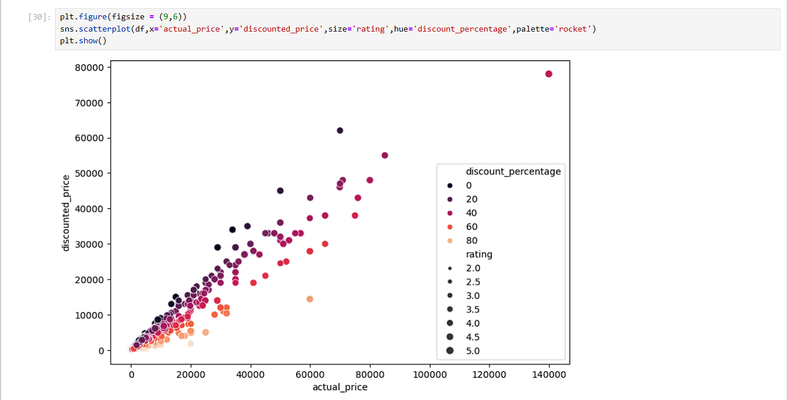
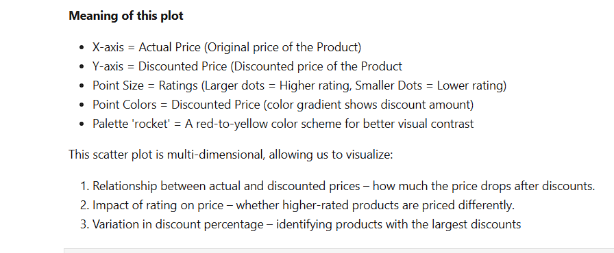
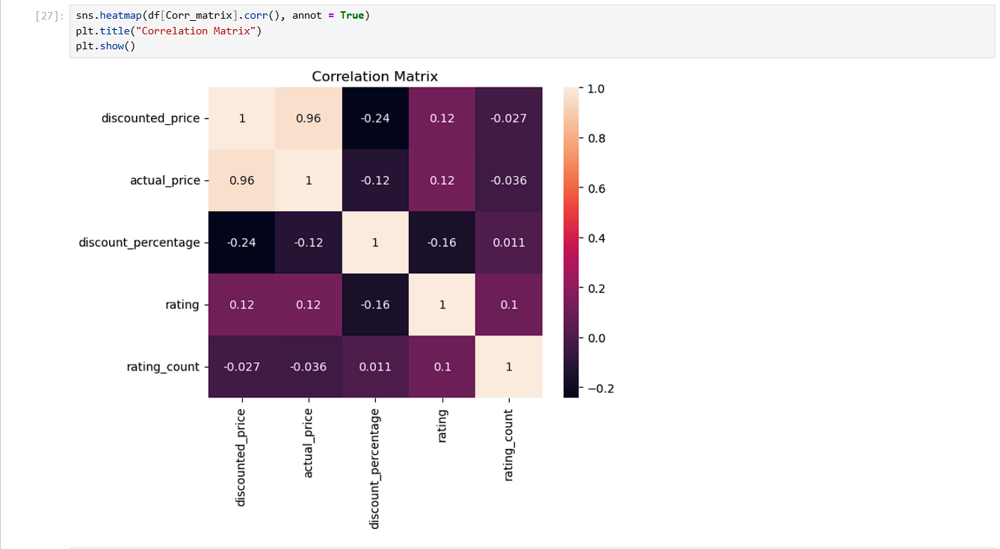
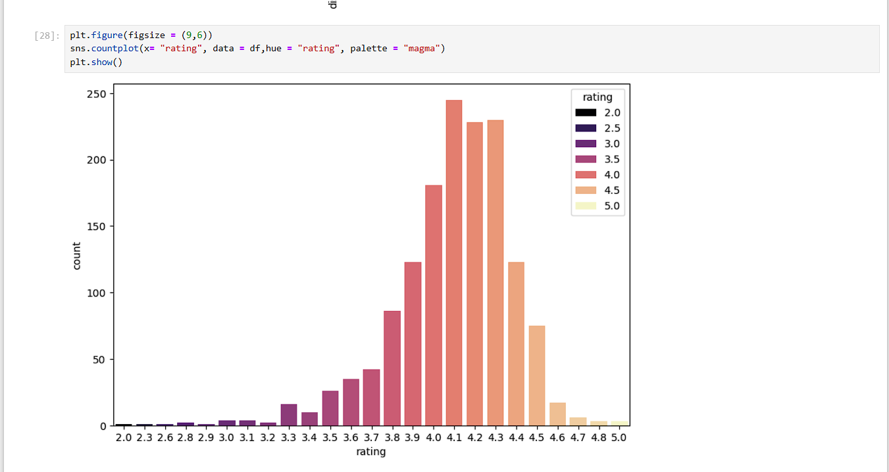
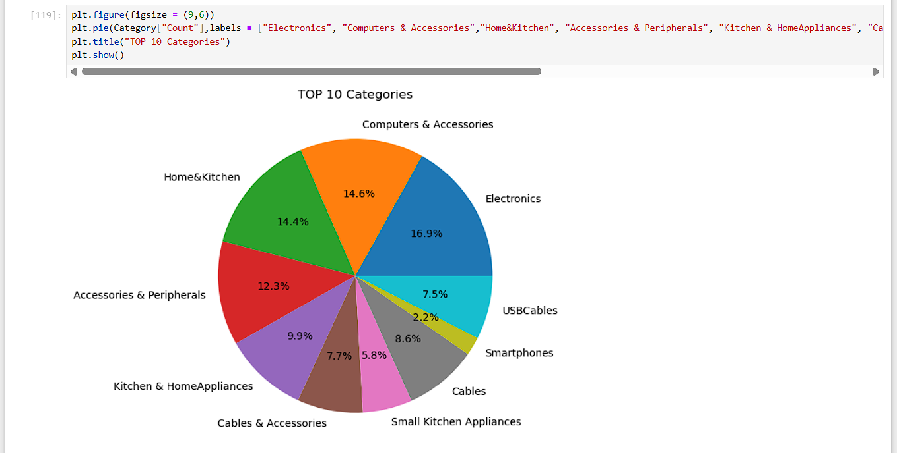
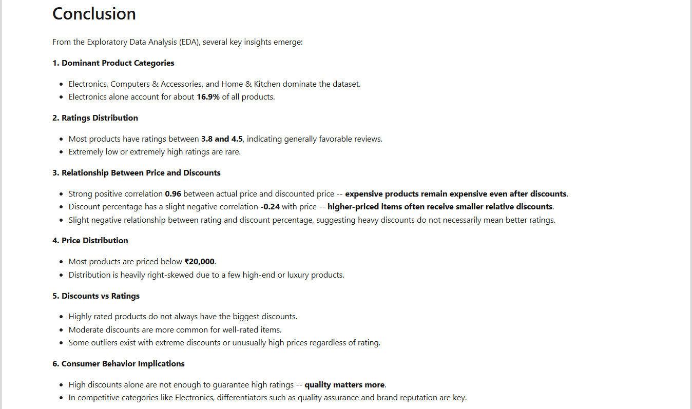

# 🛒 Amazon Product Data Analysis Dashboard

## Project Overview
This project presents an **end-to-end analysis of Amazon product data** using Python. The goal is to explore how **price, discounts, and brand quality** influence consumer ratings and purchasing behavior. Insights from this analysis can help guide **pricing strategies, marketing campaigns, and product positioning**.

Key features of the analysis:
- Analyze **price vs discount trends**
- Explore **rating trends by brand and category**
- Identify patterns linking **consumer behavior to product strategy**

## Tools Used
- **Python** (Pandas, NumPy, Matplotlib, Seaborn) – Data cleaning, transformation, and EDA
- **Jupyter Notebook** – Interactive analysis and visualization
- **Excel / CSV** – Data storage and preprocessing

## Key Insights
- Premium brands maintain **high ratings even with lower discounts**
- Heavy discounts do not always result in higher ratings or sales
- Certain categories show **strong correlation between price and rating**, while others do not
- Brand reputation and product quality often outweigh discounts in influencing purchase decisions

## Dashboard / Analysis Preview
### Price vs Discount Analysis

### Corelation Matrix

### Ratings 

### Top 10 Category

### Conclusions

## Dataset
- **Rows:** ~10,000+ product records
- **Columns:** Product Name, Brand, Category, Price, Discount, Ratings, Reviews

