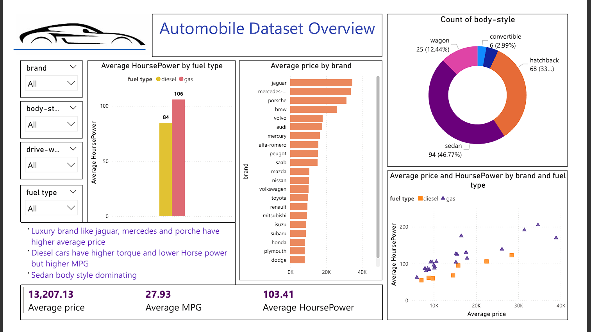
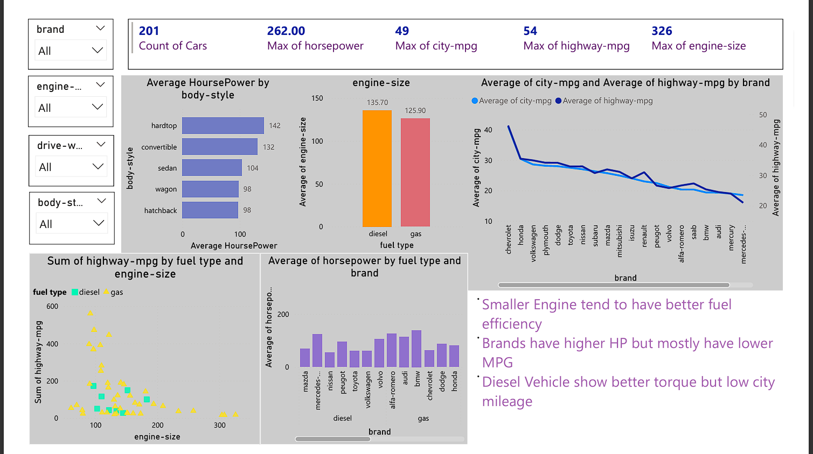
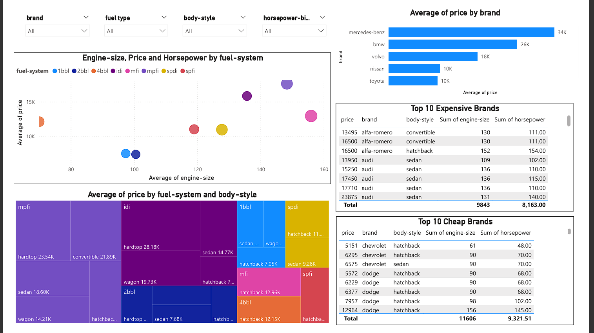
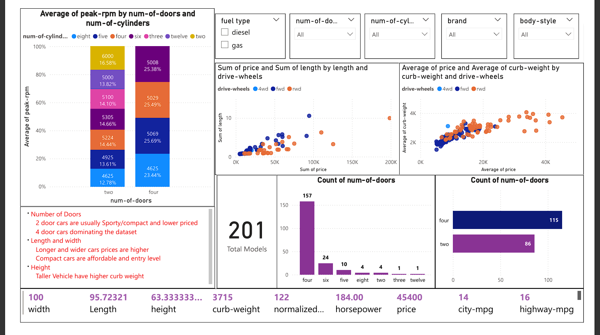

# Automobile Data Analysis

## Project Overview
This project analyzes automobile data using Python and Power BI to understand key metrics affecting car prices and performance.

## Tools Used
Python (Pandas, NumPy)
Power BI
Jupyter Notebook

## Key Insights
- Car price trends by brand
- Power-to-weight ratio analysis
- Body style distribution

## Dashboard
Power BI dashboard created to visualize insights.

## Dataset
Automobile dataset used for analysis.

## Dashboard Preview

