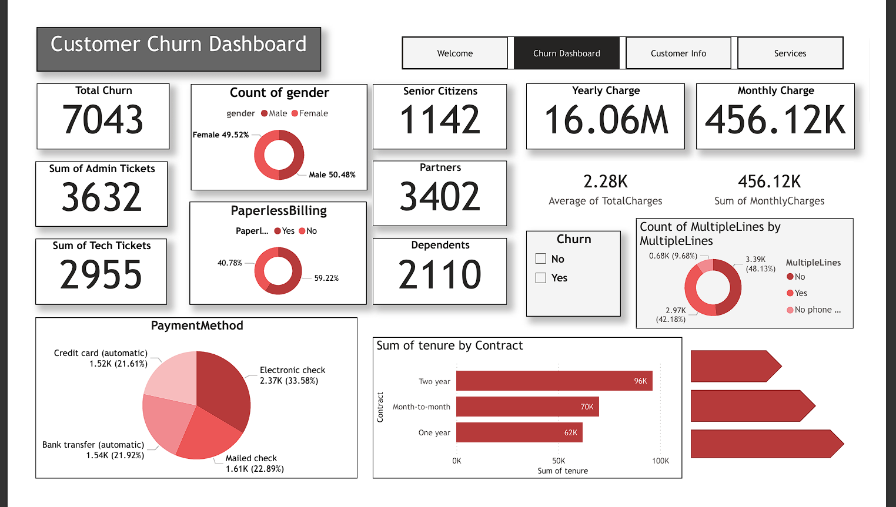
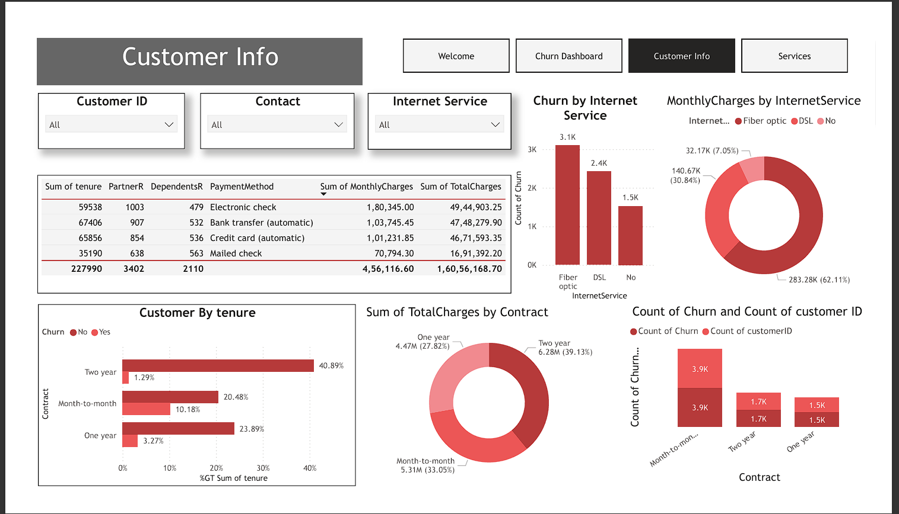
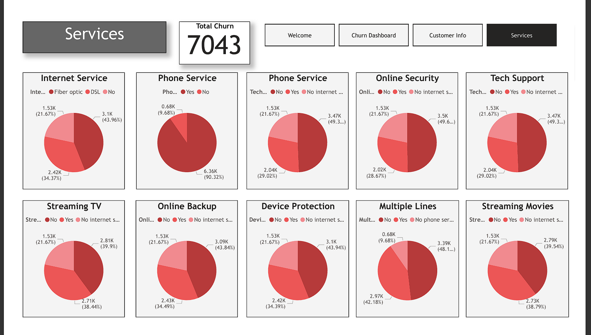

# Churn Dataset Analysis Dashboard

## Project Overview
This project analyses customer churn data to identify high-risk customer segments and understand key factors influencing churn. Using Power BI for data cleaning, exploratory analysis, and for interactive dashboard creation, the project helps visualize trends in service usage, tenure, billing, and customer details, enabling better retention strategies.

## Tools Used
- **Power BI** – Interactive dashboards and KPI tracking, Data cleaning and visualization  
- **SQL / Excel** – Data querying and preparation

## Key Insights
- Identified high-risk customer segments likely to churn  
- Key churn patterns observed in service usage, billing, and tenure  
- Insights support targeted retention strategies for 1000+ customers

## Dashboard Screenshot

## Dataset
- 7,000+ rows of anonymized customer data  
- Columns include: Customer ID, Tenure, Service Usage, Billing Details, Churn Status  
