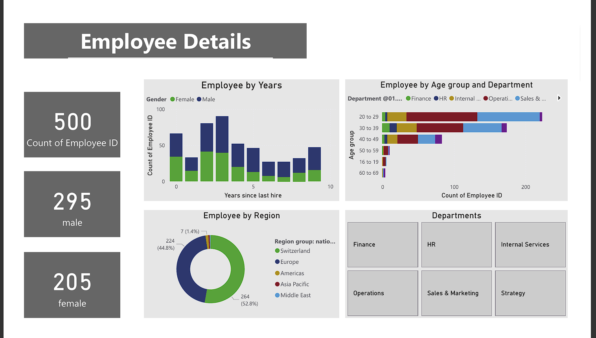
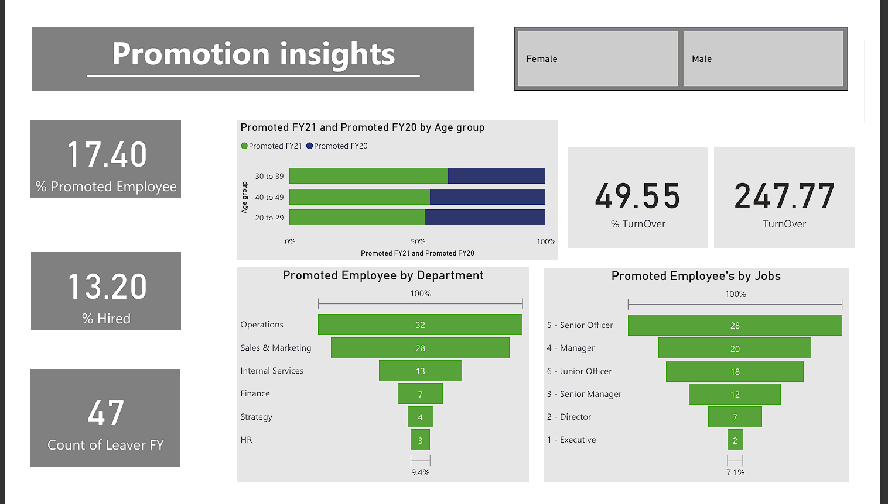
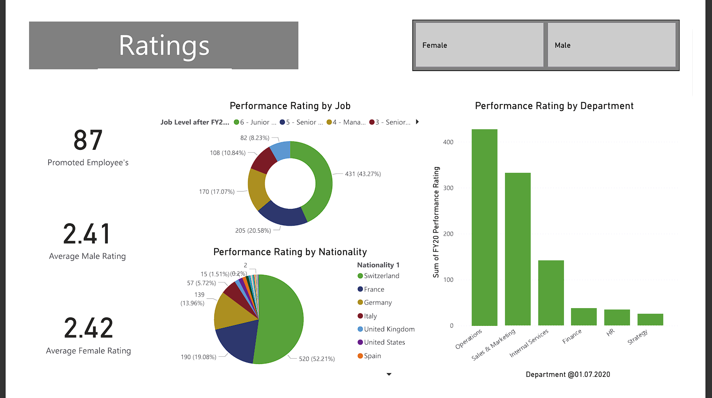

# Diversity Analysis Dashboard

## Project Overview
This project analyses diversity data to understand patterns across different groups. Using Power BI for data cleaning, exploratory analysis and for interactive dashboards, the project helps visualize key metrics such as gender distribution, age groups, departmental representation, and other diversity indicators. The insights enable data-driven decisions to improve inclusivity and representation.

## Tools Used
- **Power BI** – Interactive dashboards, filtering, and KPI visualization, Data cleaning, transformation, and analysis  
- **Excel / SQL** – Data preparation and querying  

## Key Insights
- Gender distribution across departments  
- Age group representation and trends  
- Identification of underrepresented segments  
- Visualization of diversity metrics for actionable insights  

## Dashboard Screenshot

## Dataset
- Rows: [Number of records, e.g., 5,000+ employees/customers]  
- Columns: Gender, Age, Department, Tenure, Ethnicity, Churn/Retention Status  
